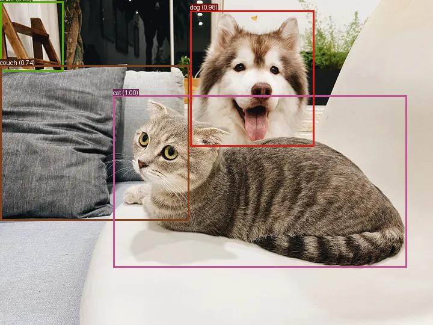
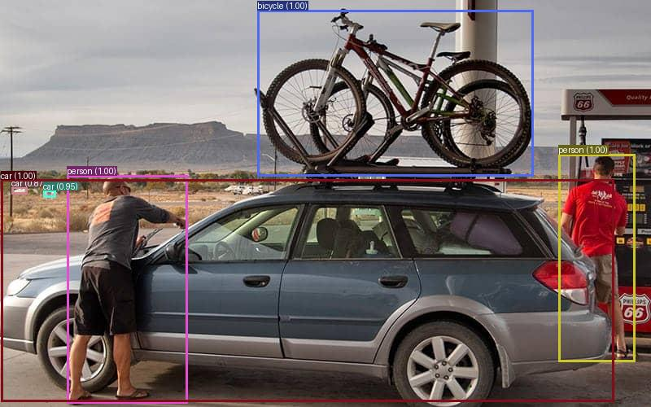

# Object Detection and Sentiment Analysis

<!--  -->

<div style="display: flex; justify-content: space-around;">
  
  
</div>
<div style="display: flex; justify-content: space-around;">
  
  
</div>

This project uses Hugging Face Transformers to perform object detection and sentiment analysis. It provides a command-line interface for analyzing images and text data.

## Clone the Repository
First, clone the repository from GitHub:
```bash
git clone https://github.com/thxrhmn/object-detection-sentiment-analysis.git
cd object-detection-sentiment-analysis
```

## Installation
To set up the environment, follow these steps:

```bash
# Reference documentation: https://huggingface.co/docs/transformers/quicktour
virtualenv venv
source venv/bin/activate
pip install -r requirements.txt
```

## Usage

You can run the application to perform object detection and sentiment analysis from the command line.

## Object Detection

To perform object detection on an image, use the following command:
```bash
python main.py --image path/to/image.png
```
You can also specify a custom font for annotations using the --font argument. The default font path is `./arial.ttf`. Here is an example:
```bash
python main.py --image path/to/image.png --font path/to/custom/font.ttf
```
Result Example:
```bash
Object Detection Results:
[
    {
        "score": 0.9278369545936584,
        "label": "chair",
        "box": {
            "xmin": 0,
            "ymin": 2,
            "xmax": 105,
            "ymax": 118
        }
    },
    {
        "score": 0.7412029504776001,
        "label": "couch",
        "box": {
            "xmin": 0,
            "ymin": 108,
            "xmax": 314,
            "ymax": 366
        }
    },
    {
        "score": 0.9985418319702148,
        "label": "cat",
        "box": {
            "xmin": 188,
            "ymin": 158,
            "xmax": 676,
            "ymax": 444
        }
    },
    {
        "score": 0.9817272424697876,
        "label": "dog",
        "box": {
            "xmin": 316,
            "ymin": 17,
            "xmax": 522,
            "ymax": 243
        }
    }
]
```

## Sentiment Analysis

To analyze sentiment for a list of sentences, use the following command:


```bash
python main.py --sentences "I love this!" "This is terrible."
```

To analyze sentiment from a file containing sentences (one per line), use:

```bash
python main.py --sentences-file path/to/sentences.txt
```

# Code Overview
## Functions

- `analyze_sentiment(texts)`: Analyzes the sentiment of a list of sentences and returns the results in JSON format.
- `perform_object_detection(image_path)`: Performs object detection on an image and returns the results in JSON format.
- `read_sentences_from_file(file_path)`: Reads sentences from a file, each sentence on a new line.

## Main Script

The `main()` function sets up command-line arguments for object detection and sentiment analysis. It handles different cases based on provided arguments:

- `--image`: Path to the image file for object detection.
- `--font`: Path to the font file for annotations (default is ./arial.ttf).
- `--sentences`: List of sentences for sentiment analysis.
- `--sentences-file`: Path to a file containing sentences for sentiment analysis.

## Requirements

- Python 3.x
- transformers library
- Pillow library
- Other dependencies listed in requirements.txt

## License

This project is licensed under the MIT License. See the LICENSE file for details.
